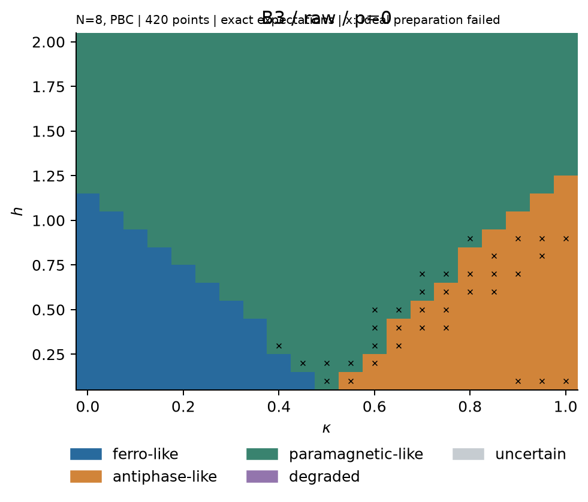
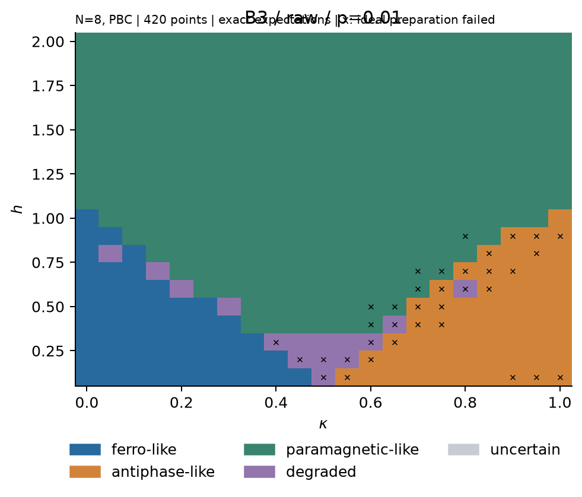
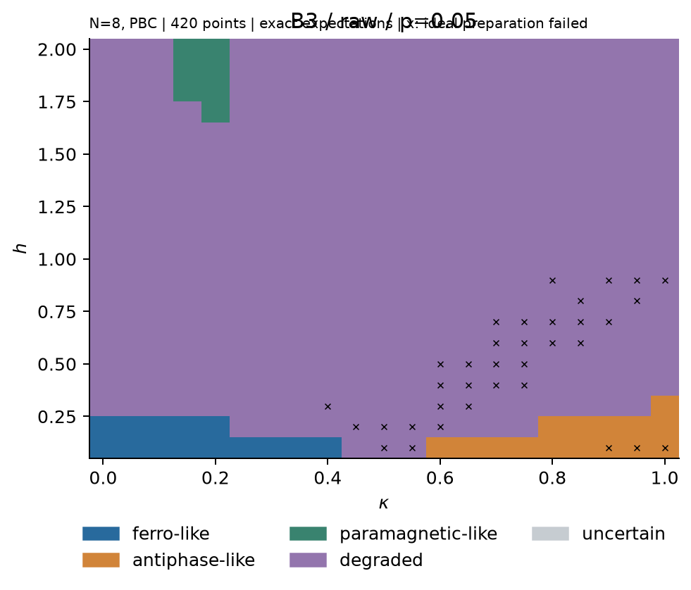

# Noise-Aware ANNNI Phase Diagnostics

Q-SITE 2026 — Quantum Coalition Scientific Track  
Team hamster

Shupei Zhang · Yangxin Zhou · Michael Li · Kathy Chen

## Overview

We investigate the periodic one-dimensional ANNNI model under target-only depolarizing noise after every CNOT. Energy-optimized low-CNOT preparation, exact-diagonalization references, phase diagnostics and cost-controlled error mitigation distinguish observable reconstruction from reliable phase-boundary inference.

## Required deliverables

[Executed notebook](submission.ipynb) · [Offline HTML](submission.html) · [3-page report](report.pdf) · [Presentation PDF](presentation.pdf) · [Editable PPTX](presentation.pptx) · [Speaker notes](speaker_notes.md)

The eight-slide presentation has an estimated 6 min 10 sec script; delivery format must be checked privately in the competition dashboard.

## Main results

- On the descriptive 420-point N8 grid, B0 → B3 reduces median CNOTs from 192 to 96. Mean pointwise maximum correlation error decreases from 0.2638 to 0.1432 at p=.01 and 0.4454 to 0.3666 at p=.05. Ideal joint preparation coverage decreases from 407/420 to 385/420. These are observable errors, not phase-label accuracy.
- On **45 frozen coordinates**, at equal actual CNOT-shots, quadratic ZNE reduces ED-target observable-vector MSE from 0.017544297 to 0.001622712 at p=.01 (**90.75%**) and 0.105113706 to 0.078636114 at p=.05 (**25.19%**). SV gives 0.012352926 and 0.102311658. This is not an improvement in phase-map accuracy.
- G = sum(shots × literal CNOT count). Raw/SV use 100,000 total shots per repeat; quadratic ZNE uses 33,334 to match G. Equal G is not equal wall-clock, one-qubit-gate, measurement-setting or classical-processing cost. ZNE reduces bias while increasing sampling error; at p=0 it worsens all 45 coordinate-mean errors.
- **All six B3 response windows are executed** (κ=0,.3,.45,.5,.55,.8); κ=.5 remains reference-unresolved. Lower pointwise MSE does not guarantee better feature localization. Endpoint, competing-peak and branch-sensitive failures remain visible.

Numbers are generated from [frozen statistics](release_statistics.json), using only 2,718 active followup records. The 648 excluded attempts remain separate evidence, never pooled into final inference. MSE retains the original 17 equal-weight components and 32 measurement repeats; only six of the 45 coordinates have independent interior labels.

## Phase diagrams

N8, PBC, B3 raw exact expectations, frozen D3 diagnostic. Same axes and legend; colors are **estimated phase-like regions**, not independently validated physical labels. Crosses retain preparation failures; uncertain/degraded outputs remain explicit.

| p=0 | p=.01 | p=.05 |
|---|---|---|
|  |  |  |

Finite-shot and full-grid equal-shots mitigation comparisons are separate in the notebook. The 45-point equal-G cohort is not extrapolated into a full equal-G map.

## Methods

ED references retain finite-size and OBC/PBC distinctions. B0 is fixed six-layer HVA; B3 is multi-reference adaptive low-CNOT preparation; B5 is a stricter selection comparison. H6 is a regional physical/domain-wall candidate union, **not** six-layer HVA. Every actual CNOT receives target-only PennyLane-convention depolarization. Frozen D1–D5 diagnostics, raw, linear/quadratic ZNE and signed SV retain their original definitions. [Methods](docs/METHODS.md) · [Evidence ledger](docs/EVIDENCE_LEDGER.md).

## Extensions and limits

N≥12 circuits, multiple detectors, mitigation, Trotterized dynamics and floating-phase investigation were executed. H6 improves low-field N8 candidate availability at substantially greater gate/search cost; it does not universally replace B3 or improve difficult N12 transfer. Finer Trotter steps improve ideal discretization while extra CNOTs can worsen noisy error.

No complete strong-noise map recovery, quantum advantage, controlled continuous floating interval, or two transition brackets in the latest κ=.8 OBC scan are established. Historical optimistic floating-center interpretations are qualified. [Results and limitations](docs/RESULTS_AND_LIMITATIONS.md) · [Bonus evidence](docs/BONUS_STATUS.md).

## Reproduction

Install the matching isolated environment using [instructions and tested locks](docs/REPRODUCE.md). From the repository root:

```bash
python scripts/execute_notebook.py
python scripts/release.py verify-physics --quick
python scripts/release.py verify-data
python scripts/release.py redraw --out build/redraw
```

Default notebook execution rebuilds statistics/plots and representative explicit-circuit and saved-count checks. Deep V1 separately audits all active counts. V3 (`verify-exact-replay`) is strict and environment-gated: a mismatch is **SKIPPED_ENV_MISMATCH**, not PASS. Outputs go to `build/`; no 9GB archive or optional tensor download is required. Original PennyLane implementation and SDK crosscheck remain available.

## Repository contents

Historical result paths are preserved to keep coordinate/parameter/gate references resolvable; they are evidence namespaces, not the order in which a reader should follow the project.

- `results/baseline/`: N8 ED and N8/12/16 slices.
- `results/stage3_v1/`, `stage4_v1/`, `stage4_upgrade_v1/`: preparation, B0/B3 main results, diagnostics, mitigation and dynamics.
- `results/stage5_v1/`: candidate-selection checks and independent physical/transfer evidence.
- `results/stage6_v1/`: reference atlas, low-field/confirmation, N12, noise, controlled floating scan and failures.
- `results/stage6_followup_v1/`: all six windows, equal-shots/equal-G comparisons, active indices and original joint counts.
- `annni/`, `configs/`, `research_scripts/`, `tests/`: actual algorithms, settings and checks.
- `provenance/`: source/path maps, scientific hashes, optional asset manifest.

Optional large tensors and deep indices are available as [17 verified Release assets](https://github.com/sp-zh/qsite-2026-annni-hamster/releases/tag/v1.0.0). The release asset tag preserves the initial publication snapshot; the current complete submission is the `main` branch.

See [full archive note](docs/FULL_ARCHIVE_NOTE.md) for optional tensor/large-index assets and exact exclusions. Wide scientific directories are retained where moving files would break archived index/hash references. No environment, old packaging ZIP or credential is included.

## Attribution

Upstream challenge and starter materials: [benmcdonough20/QSITE-2026-QuantumCoalition](https://github.com/benmcdonough20/QSITE-2026-QuantumCoalition), local snapshot in `upstream/`. Preserve its [MIT license](docs/third_party/QuantumCoalition-MIT.txt). No global license is assigned to original team work without a team decision. [Third-party notices](docs/THIRD_PARTY_NOTICES.md).
