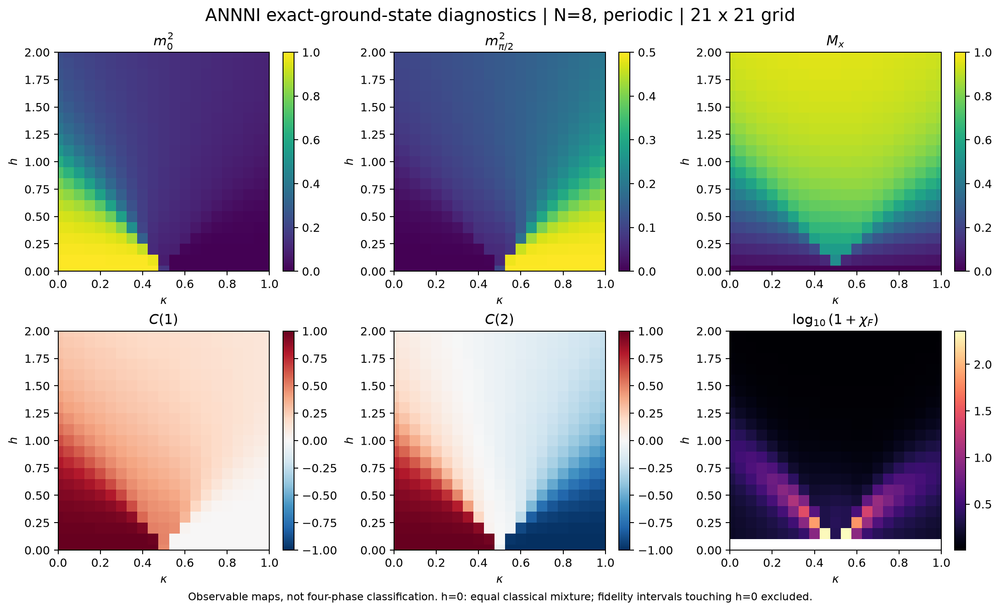
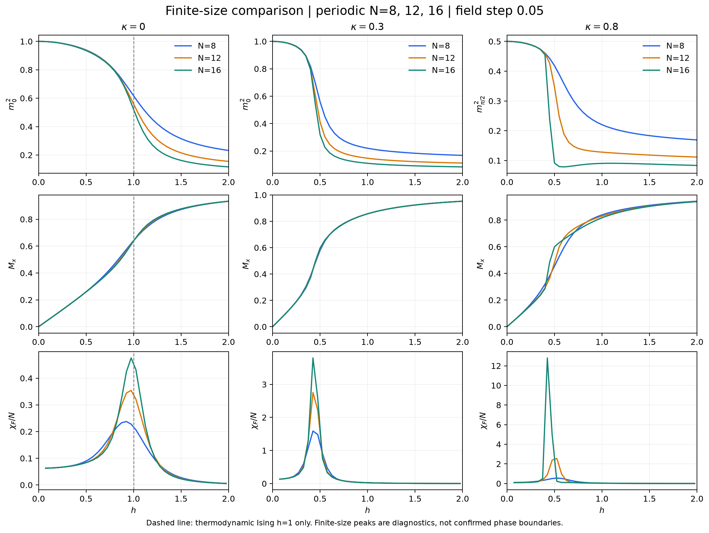

# 无噪声基线实验结果

本次完成了 **815 次参数点计算**（包含不同扫描间的重复点）：
N=8 的 21×21 全网格、N=8/12/16 的三条 41 点切片，以及五个尺寸相容性对照点。
运行时间约 4.21 秒（不含环境安装、测试和 notebook 执行）。
上游版本为 57f9a537d24c69328dedf915ad58d1d2bf505135，没有修改上游代码。

## 数值可信度

全部扫描的最大本征残差为 **2.560e-10**。
13 项自动化测试通过，覆盖上游 PennyLane Hamiltonian 的逐元素比较、
小尺寸密集本征分解、有限周期 Ising 链的解析基态能量、经典铁磁与反相极限、
结构因子背景与和规则、低场平移对称性和保真度约定。

仅有小残差不足以排除近简并态混合。第一轮随机初始向量使 N=16 低场保真度出现伪尖峰；
最终实现使用均匀正初始向量，并投影到零动量，再重新计算能量与残差。
已重新生成本目录全部扫描数据和图表。

## 首轮发现

1. **Ising 极限自洽。** κ=0 时，序参量导数峰随 N 从 8 增加到 12/16，
   由网格上的 h=0.95 移至 h=1.00；保真度峰由 0.925 移至 0.975，
   与热力学极限 h=1 的位置相容。这里没有对峰位置做连续拟合。
2. **反相区对尺寸更敏感。** κ=0.8 的导数峰由 N=8 的 0.60 变为 N=16 的 0.45。
   这表明不能用单个小尺寸峰位置作为最终相边界；本轮没有做热力学外推或确认 floating phase。
3. **周期相容性对照复现。** 固定 (κ,h)=(0.8,0.2) 时：

| N | C(2) |
|---:|---:|
| 6 | -0.327918371 |
| 8 | -0.982630685 |
| 10 | -0.589378731 |
| 12 | -0.983589443 |
| 16 | -0.983645886 |

N=8、12、16 的 C(2) 接近 −1；N=6、10 因周期环不能无缺陷容纳四周期图案而差异明显。
因此主要尺寸比较使用 4 的倍数。

## 有限尺寸诊断峰

| N | κ | 序参量负导数峰 h | 保真度峰 h |
|---:|---:|---:|---:|
| 8 | 0.0 | 0.950 | 0.925 |
| 8 | 0.3 | 0.450 | 0.425 |
| 8 | 0.8 | 0.600 | 0.525 |
| 12 | 0.0 | 1.000 | 0.975 |
| 12 | 0.3 | 0.450 | 0.425 |
| 12 | 0.8 | 0.500 | 0.525 |
| 16 | 0.0 | 1.000 | 0.975 |
| 16 | 0.3 | 0.450 | 0.425 |
| 16 | 0.8 | 0.450 | 0.425 |

切片步长为 0.05。保真度定义在相邻 h 的**中点**，所以表中的 0.425、0.975 等值
不表示精确到了 0.001。导数计算排除 h=0 的混合态端点。
此表仅列全切片上的最大峰；没有把一个峰强行对应到两条反相/floating/顺磁边界。
下一阶段需局部加密并比较多个诊断量，不能把这里的网格峰位置当成已验证的四相分类。

## 图表

## 解释边界及下一步

- h=0 使用所有经典最低能量构型的等权非相干混合；特别在 κ=0.5，不声称它等于 h→0+ 极限。
- 结构因子包含 1/N 自关联背景；不能用严格大于零作为有序相判据。
- 本轮只有 ED。没有完成 VQE、p=0.01/0.05 的门噪声实验、ZNE 或最终比赛报告。
- 下一步先在代表点校准参数化制态电路，同时检查能量、结构因子与保真度；
  达标后固定参数比较三个噪声水平，以分离制态误差和门噪声误差。

原始数据见本目录的 CSV/NPZ；环境版本、模型约定、代码 SHA256 和上游来源见 metadata.json。
