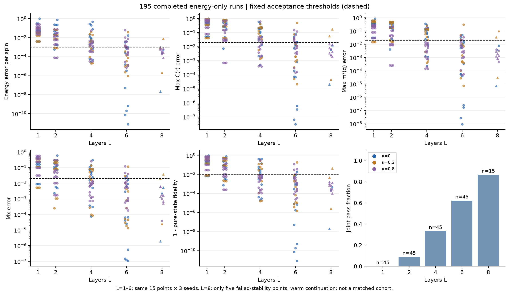
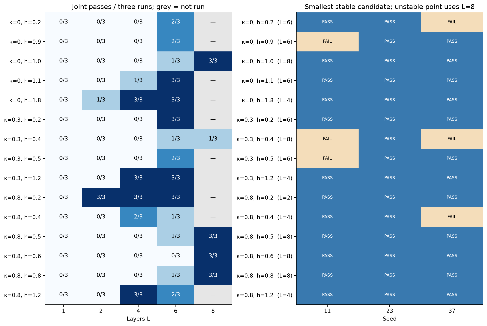
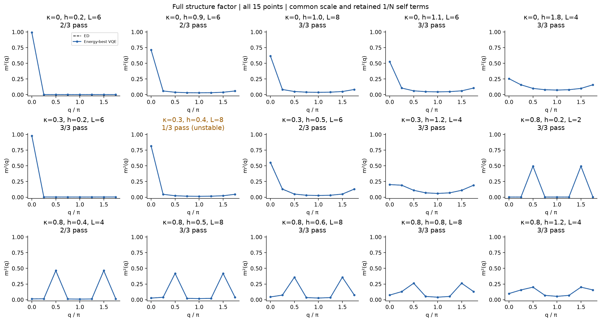
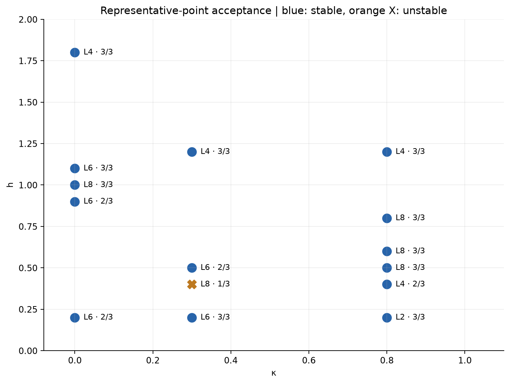

# Stage 2 — executed calibration, diagnostics and gate-noise tests

**Decision: NO-GO for an unrestricted 21×21 noisy scan with the current protocol.**
Useful calibrated states are retained: 14/15 points have a depth with at least two of three trajectories passing all engineering thresholds. Bounded, individually gated follow-up slices can proceed. No complete noisy grid was run.

## What actually ran

- Existing tests rerun before implementation: 13 passed. Full suite after additions: 25 passed in 1.95s.
- Main calibration: 15 points × 4 depths × 3 seeds = 180 runs.
- Prespecified fallback: five failed-stability points × 3 seeds at L=8 = 15 additional runs. Total 195; none discarded.
- All-wavevector diagnostics consumed existing ED files only; no complete ED scan was rerun.
- Five calibrated points × p=0, .01, .05: all 15 density-matrix simulations ran.
- All upstream and baseline files were hash-verified unchanged. Python 3.14.5 / PennyLane 0.44.1, all installed lockfile versions matched; no dependency changes.
- Final artifact verification independently checked 195 saved runs, all selected states against PennyLane, and all 15 density archives.

## Circuit and optimization

Initial state is H on all eight wires. Each layer executes, in order:
NN edges (i,(i+1) mod 8), then NNN edges (i,(i+2) mod 8), then every wire's RX.
Each edge list is traversed i=0..7.
IsingZZ(2γ)=exp(-iγ ZiZj), IsingZZ(2η)=exp(-iη ZiZj), RX(2β)=exp(-iβ Xi).
Each layer is U_X(β) U_NNN(η) U_NN(γ) acting on the previous state; later gates multiply on the left.
There are 3L independent parameters, not shared between layers.

The simulator fuses each commuting family only to accelerate exact pure-state evolution. Its analytic adjoint gradient was checked against PennyLane backprop and central differences.
No ED StatePrep, ED fidelity objective, or output projection is used for main optimization.
ED values are loaded only after energy optimization to score the result.
Wire 0 is the most significant bit; basis and asymmetric-state checks establish the mapping.

L-BFGS-B minimizes total energy with maxiter=400, maxfun=20000, ftol=1e-12, gtol=1e-8, maxls=30.
Independent nonzero initialization uses uniform[-.5,.5], SeedSequence([seed,point_index,L]), seeds 11/23/37.
Every run saves initial/final parameters, full state/C(r)/m²(q), Mx, energy/gradient trace, iteration/evaluation counts, status, time, and resource counts.
Selection within each point/depth uses lowest energy, never post-hoc fidelity.
Fallback was triggered at the recorded UTC time in fallback_decision.json, using each seed's own L6 trajectory plus two independently sampled small layers.
This is warm continuation, not three fresh independent L8 restarts, and not three copies of the best L6 seed. No thresholds or budgets were changed.

## Acceptance and all 15 points

observable_pass requires δe≤.001, εC≤.02, εSF≤.02, εMx≤.02. state_pass requires F≥.99.
joint_pass is their conjunction; optimizer success is recorded separately and is not a substitute for either.
A candidate needs at least 2/3 joint passes, with its minimum-energy run passing too.
Three seeds provide an operational repeatability check, not a confidence bound on success probability.

| κ | h | L1 | L2 | L4 | L6 | L8 rescue | candidate L | best δe | best F | optimizer success / 3 |
|---:|---:|---:|---:|---:|---:|---:|---:|---:|---:|---:|
|0|0.2|0/3|0/3|0/3|2/3|—|6|7.24e-11|1.00000000|3/3|
|0|0.9|0/3|0/3|0/3|2/3|—|6|7.65e-12|1.00000000|2/3|
|0|1.0|0/3|0/3|0/3|1/3|3/3|8|2.17e-08|0.99999998|1/3|
|0|1.1|0/3|0/3|1/3|3/3|—|6|6.46e-10|1.00000000|1/3|
|0|1.8|0/3|1/3|3/3|3/3|—|4|2.97e-05|0.99998092|0/3|
|0.3|0.2|0/3|0/3|0/3|3/3|—|6|9.17e-07|0.99999851|1/3|
|0.3|0.4|0/3|0/3|0/3|1/3|1/3|8 unstable|2.06e-06|0.99999746|0/3|
|0.3|0.5|0/3|0/3|0/3|2/3|—|6|7.76e-05|0.99973412|0/3|
|0.3|1.2|0/3|0/3|3/3|3/3|—|4|2.03e-05|0.99998461|1/3|
|0.8|0.2|0/3|3/3|3/3|3/3|—|2|7.58e-05|0.99974843|3/3|
|0.8|0.4|0/3|0/3|2/3|1/3|—|4|0.000369|0.99837955|3/3|
|0.8|0.5|0/3|0/3|0/3|1/3|3/3|8|7.68e-05|0.99989613|0/3|
|0.8|0.6|0/3|0/3|0/3|0/3|3/3|8|0.000272|0.99966732|1/3|
|0.8|0.8|0/3|0/3|0/3|1/3|3/3|8|0.000193|0.99980354|0/3|
|0.8|1.2|0/3|0/3|3/3|2/3|—|4|0.000299|0.99975498|3/3|

The table reports joint passes, not optimizer convergence. Best δe/F are from the **same minimum-energy run** at the candidate depth.
Every depth's min/median/max metrics and counts are in summary.csv; every individual run is in all_runs.csv and runs/*.npz.
Across all 195 runs: 60 observable passes, 102 state passes,
60 joint passes and 142 optimizer-success exits.
53 runs stopped at the bounded iteration budget.
Negative δe was not clipped; values below −1e-9 would raise a consistency failure. Observed minimum δe=7.652e-12.

### Unresolved point and failure interpretation

(κ,h)=(.3,.4) is still 1/3 joint pass at both L6 and L8:

| run | δe | εC | εSF | εMx | F | optimizer status |
|---|---:|---:|---:|---:|---:|---|
|p06_L6_s11|0.001314|0.07628|0.04845|0.02995|0.992113|STOP: TOTAL NO. OF ITERATIONS REACHED LIMIT|
|p06_L6_s23|3.467e-05|0.0008943|0.000468|0.0002616|0.999933|STOP: TOTAL NO. OF ITERATIONS REACHED LIMIT|
|p06_L6_s37|0.03937|0.4926|0.3107|0.1178|0.814047|CONVERGENCE: RELATIVE REDUCTION OF F <= FACTR*EPSMCH|
|p06_L8_s11|0.000884|0.05649|0.03403|0.01951|0.995339|STOP: TOTAL NO. OF ITERATIONS REACHED LIMIT|
|p06_L8_s23|2.056e-06|4.622e-05|2.976e-05|2.52e-05|0.999997|STOP: TOTAL NO. OF ITERATIONS REACHED LIMIT|
|p06_L8_s37|0.007802|0.1745|0.09962|0.03667|0.956751|STOP: TOTAL NO. OF ITERATIONS REACHED LIMIT|

At L8 seed 11, energy and F pass but C(r) and m²(q) fail. Seed 37 remains in a substantially worse state.
Seed 23 achieves excellent observables and F but reaches the iteration limit.
This supports sensitivity to initialization/local minima and limited optimization budget; it does not prove ansatz expressibility is impossible.
No enlarged low-energy subspace or relaxed fidelity threshold was used.
All other failed shallow-depth groups remain in the table; the passing seed in a failed group does not make that group stable.

### Candidate and resources

No single tested uniform depth is established across all 15 points.
The smallest stable candidates are L2 (one point), L4 (four), L6 (five), and L8 continuation (four).
L8 was only tested on the prespecified five failures, so its performance cannot be extrapolated to all points.

Compilation is literal CNOT(control,target)–RZ(2a,target)–CNOT(control,target) for every ZZ.
Connectivity allows the specified NN/NNN logical edges directly; no unrelated 20-qubit routing graph or SWAP is introduced.
Resource counts retain zero/small rotations and do not cancel gates: CNOT=32L, parameter count=3L, compiled unitary gates=8+56L.
Scheduling respects per-wire source order; depths at L2/4/6/8 are 75/149/223/297.
Each qubit is a target 4L times. The full ordered directions and channel-inclusive depths are saved in resources_L*.json and noise schedules.json.
Different adaptive depths imply different noise exposure, a confound that must remain explicit in any future phase comparison.

## Frozen operational diagnostics v1

The main outputs are continuous features and finite-size response peaks, not four-phase labels.
All q=2πk/N are retained, with the 1/N self term and ideal antiphase peak .5.
Equivalent q and 2π−q amplitudes are averaged, not summed.
All near maxima within max(.005, .10×maximum) are retained.

Negative ordered-structure-factor derivatives and Mx derivatives use unsmoothed second-order finite differences on h>0.
Every local maximum and one-sided endpoint maximum is saved, together with supporting grid intervals.
Existing chiF uses squared overlaps at h_mid, and h=0 intervals remain NaN.
These intervals describe grid support, not statistical confidence or sub-grid precision.

The control comparison uses [m0²,2mπ/2²,Mx] and fixed analytic ferro, antiphase, plus, mixed prototypes.
Euclidean distance must be ≤.45, with a runner-up margin ≥.10, otherwise uncertain.
Completely mixed controls are degraded, not mislabeled high-field paramagnetic.
The thresholds are engineering choices frozen before noise, not fit to literature boundaries or noisy outputs.
Twelve controls across N8/12/16 passed.

At κ=.8 the first sampled non-π/2 mode exceeding π/2 is h=.65 for N12 and .50 for N16; not observed up to h=2 for N8.
N8's structure-factor/Mx/chiF peak positions are .600/.500/.525, preserving diagnostic disagreement.
All 28 local peaks, including a weak N16 h=1.55 feature, are retained.
These are finite-size mode competition and response features, not sufficient evidence for floating phase; N16 is not used to label N8.

## Actual per-gate noise

Same ideal parameters and gate schedule at every p; no retraining, no shots, no terminal-noise substitution.
Each actual CNOT is immediately followed only on its target by PennyLane D_p(ρ)=(1−p)ρ+(p/3)(XρX+YρY+ZρZ).
Both CNOTs of every ZZ decomposition get a channel, including p=0 for a matched structure.
All p=0 pure/decomposed/density checks, channel count/target checks, and density trace/Hermiticity/PSD checks passed.

| κ | h | L | CNOT | F_ED(p=0) | F_ED(.01) | F_ED(.05) | purity(.05) |
|---:|---:|---:|---:|---:|---:|---:|---:|
|0|0.2|6|192|1.000000|0.176450|0.004259|0.003909|
|0|1.8|4|128|0.999981|0.409983|0.020735|0.005088|
|0.8|0.2|2|64|0.999748|0.593900|0.081149|0.013230|
|0.8|0.5|8|256|0.999896|0.109614|0.004100|0.003907|
|0.8|1.2|4|128|0.999755|0.388588|0.017678|0.004798|

For mixed states F_ED means <ψ_ED|ρ|ψ_ED>, not a pure-state inner product.
Each noise archive saves signed εprep=O_circuit(0)−O_ED and δnoise=O_circuit(p)−O_circuit(0) separately.
At p=.05 all five frozen prototype outputs are degraded. L6 and L8 purities are close to 1/256≈.00390625.
The shorter antiphase circuit retaining more signal than the deeper ferro circuit does **not** establish intrinsic antiphase robustness.
At p=.01 the L8 representative already has ED overlap ≈.110, so depth is a substantive limitation.
There is no quantitative phase-boundary-shift claim from these five points.

## Decision and concrete next configuration

NO-GO for a blind full noisy grid under this candidate/compilation protocol.
The blockers are (i) unresolved 2/3 stability at (.3,.4), (ii) no verified common depth, (iii) strong cumulative noise,
and (iv) diagnostics are a frozen operational v1, not a validated discrete phase classifier.

A next bounded task should use saved parameters, preserve v1, and create v2:
1. Resolve (.3,.4) with a predeclared small initialization/continuation comparison and fixed budget; do not silently extend v1.
2. Compare resource-efficient compilation or a single shorter circuit candidate at existing representatives before scaling noise.
3. For any exploratory slice, first validate p=0 at every point using the same thresholds; save failures as missing/uncertain.
4. Choose and freeze the compilation/depth policy, then use the same parameters and structure across p.
5. Freeze diagnostics v1 for the first comparison; any revised thresholds become a separately reported v2.

A ready-to-review proposed configuration is configs/next_stage_proposal.json; it is **not executed** in this round.

## Measured runtime and reproducibility

Total optimizer time across the 195 saved runs: 9.247 seconds.
Calibration invocation wall times (pilot/main/fallback, including artifact work): 0.191, 7.627, 2.422 seconds.
These are local fused-simulator timings, not quantum-hardware execution costs.
Actual 15-density-check sum: 17.805 seconds; full smoke script 18.873 seconds.
A 441-point × 3-p noise run at these observed per-circuit costs would be roughly 11–44 minutes **as a linear estimate only**,
excluding retries, plotting, optimization, and changing cost/depth. It is not approved by the scientific readiness decision.

From project root:

    MPLCONFIGDIR=.mplconfig OPENBLAS_NUM_THREADS=1 OMP_NUM_THREADS=1 .venv/bin/python -m pytest -q
    OPENBLAS_NUM_THREADS=1 OMP_NUM_THREADS=1 .venv/bin/python scripts/run_calibration.py --pilot
    OPENBLAS_NUM_THREADS=1 OMP_NUM_THREADS=1 .venv/bin/python scripts/run_calibration.py
    OPENBLAS_NUM_THREADS=1 OMP_NUM_THREADS=1 .venv/bin/python scripts/run_calibration.py --fallback
    .venv/bin/python scripts/run_diagnostics.py
    OPENBLAS_NUM_THREADS=1 OMP_NUM_THREADS=1 .venv/bin/python scripts/run_noise_smoke.py
    OPENBLAS_NUM_THREADS=1 .venv/bin/python scripts/verify_stage2.py
    .venv/bin/python scripts/report_calibration.py
    .venv/bin/python scripts/build_calibration_notebook.py

Calibration commands resume only with exact code/config/input fingerprints and matching per-run NPZ hashes.
Pilot runs were reused, not counted twice. For a fresh replicate use a separate project copy or a new versioned experiment; do not delete v1.
Notebook clearly separates stored historical experiment results from its fresh small check. Eight code cells executed without cell errors; five saved output figures were inspected. The restricted macOS environment emitted a psutil permission warning during kernel shutdown, after all cells completed; the raw log is retained in notebook_execution.log. No dependency changes were made to suppress it.
No complete noisy scan, larger-N VQE, hardware, paid service, QCNN, ZNE, or dynamics was run.

## Figures

