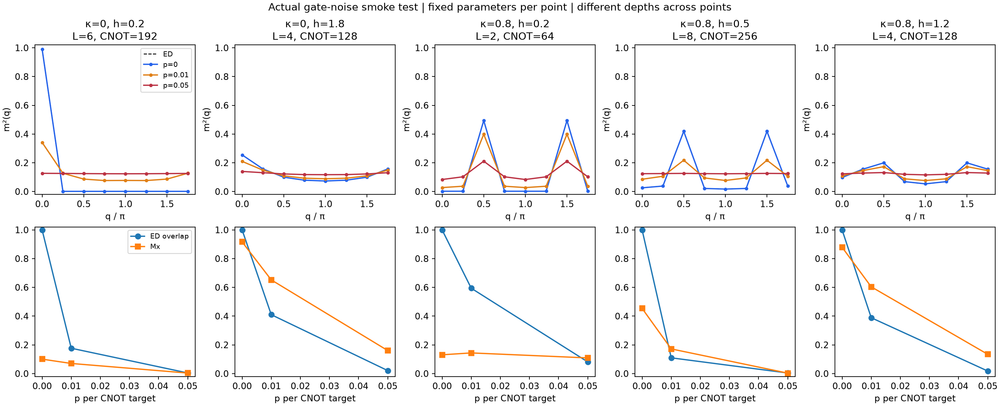

# Actual gate-noise smoke test

Five calibrated representatives, three noise levels each; all 15 density-matrix simulations actually ran.
No noisy reoptimization. Gate schedule and parameter hashes are identical across p at each point.
Pure/high-level/decomposed and p=0 density comparisons passed; all density matrices passed trace, Hermiticity and PSD checks.

| κ | h | L | p | ED overlap | purity | Mx | prototype diagnostic |
|---:|---:|---:|---:|---:|---:|---:|---|
|0|0.2|6|0|1.000000|1.000000|0.100510|ferro_like|
|0|0.2|6|0.01|0.176450|0.035913|0.070477|degraded|
|0|0.2|6|0.05|0.004259|0.003909|0.003723|degraded|
|0|1.8|4|0|0.999981|1.000000|0.916403|paramagnetic_like|
|0|1.8|4|0.01|0.409983|0.176540|0.652099|paramagnetic_like|
|0|1.8|4|0.05|0.020735|0.005088|0.160222|degraded|
|0.8|0.2|2|0|0.999748|1.000000|0.130777|antiphase_like|
|0.8|0.2|2|0.01|0.593900|0.357420|0.143775|antiphase_like|
|0.8|0.2|2|0.05|0.081149|0.013230|0.109105|degraded|
|0.8|0.5|8|0|0.999896|1.000000|0.453561|uncertain|
|0.8|0.5|8|0.01|0.109614|0.018177|0.171636|degraded|
|0.8|0.5|8|0.05|0.004100|0.003907|0.003056|degraded|
|0.8|1.2|4|0|0.999755|1.000000|0.878770|paramagnetic_like|
|0.8|1.2|4|0.01|0.388588|0.159980|0.603700|paramagnetic_like|
|0.8|1.2|4|0.05|0.017678|0.004798|0.134134|degraded|

Selection reasons:
- Point 0: low-field kappa=0, ferro-like ED correlations; smallest stable passing L=6
- Point 4: high-field kappa=0, strong transverse polarization; smallest stable passing L=4
- Point 9: low-field kappa=.8, strong period-four correlations; smallest stable passing L=2
- Point 11: kappa=.8,h=.5 near same-N diagnostic changes; L=8 remediation passed 3/3
- Point 14: high-field frustrated kappa=.8,h=1.2; smallest stable passing L=4

Full signed preparation/noise errors are in each NPZ; scalar maxima are in observations.csv.
All discrete wavevectors are saved. Mixed overlap means <psi_ED|rho|psi_ED>.
Different depths across points confound a comparison of intrinsic phase robustness. These are smoke checks, not measured boundary shifts.
At high accumulated noise, degraded/uncertain outputs are retained; they are not silently relabeled paramagnetic.
Measured total elapsed 18.873 s; density evaluation/check sum 17.805 s.

