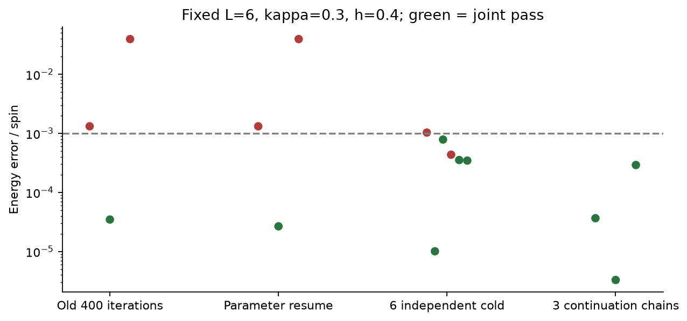
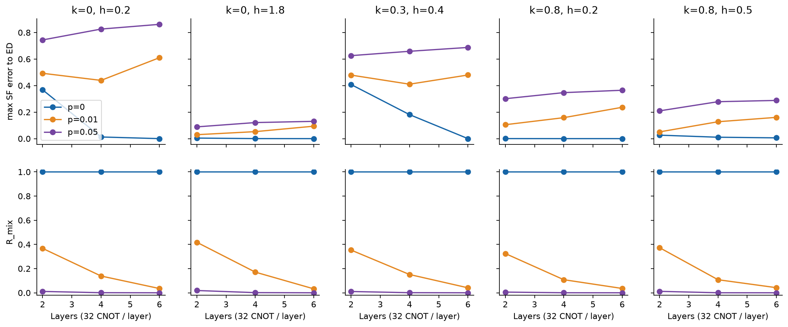
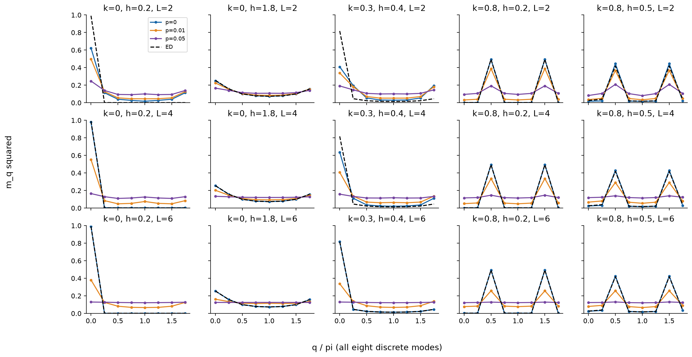
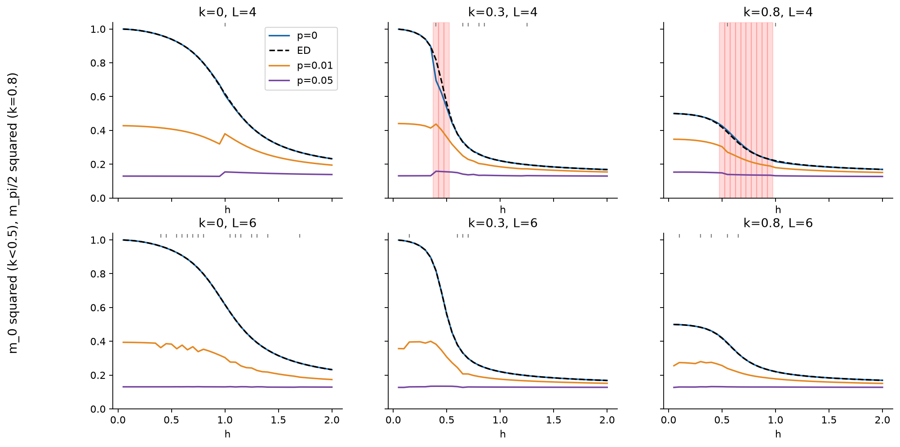
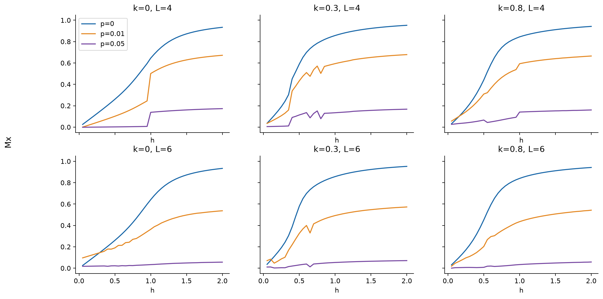
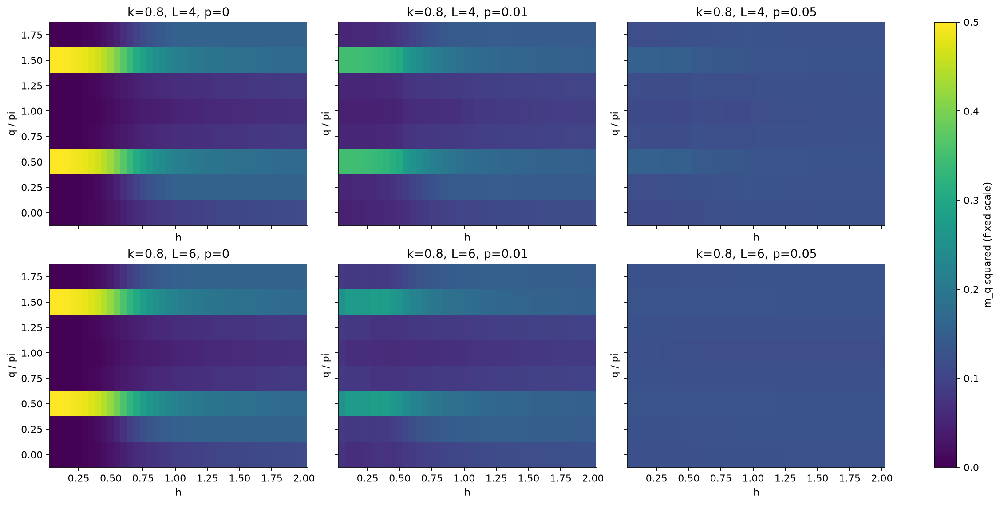
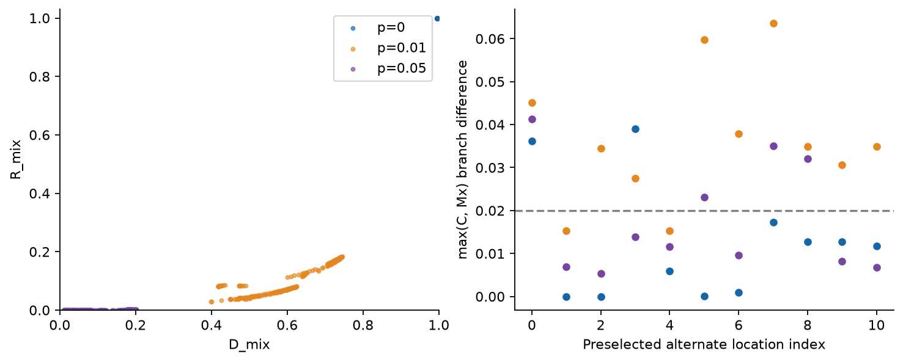
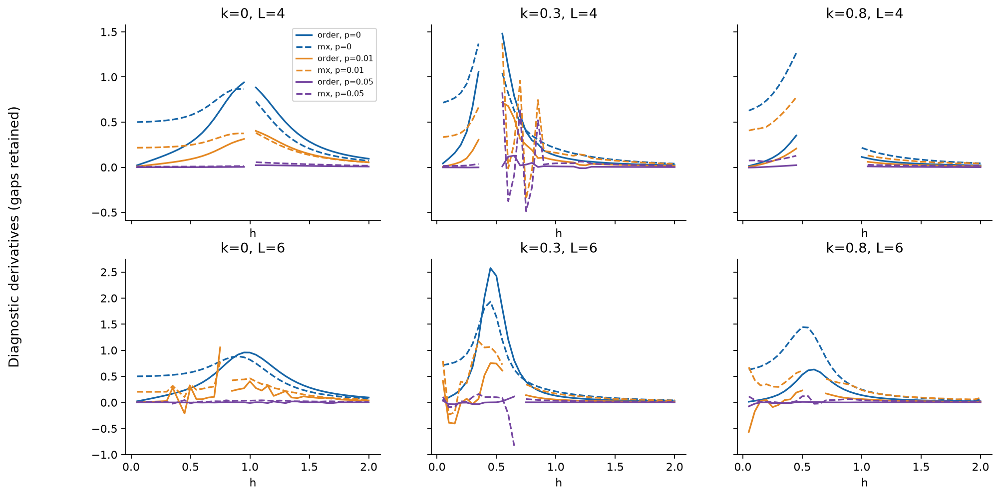
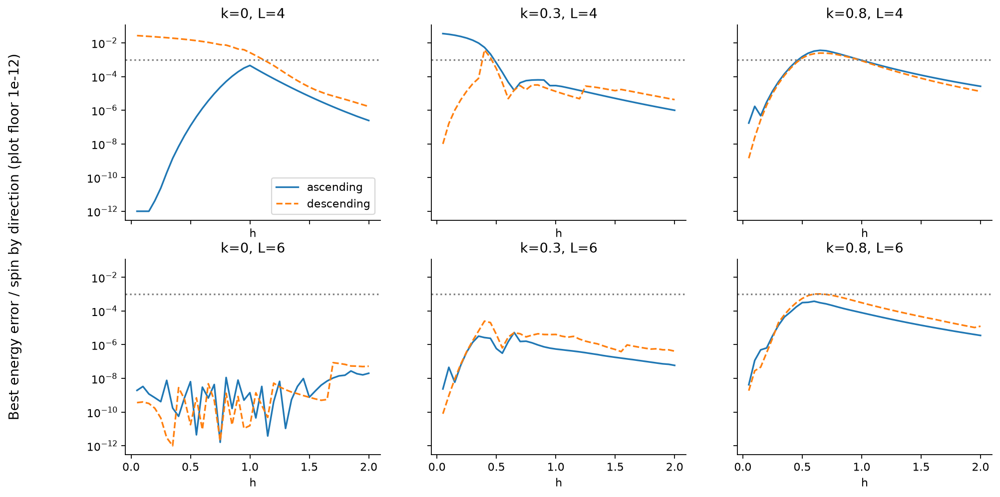
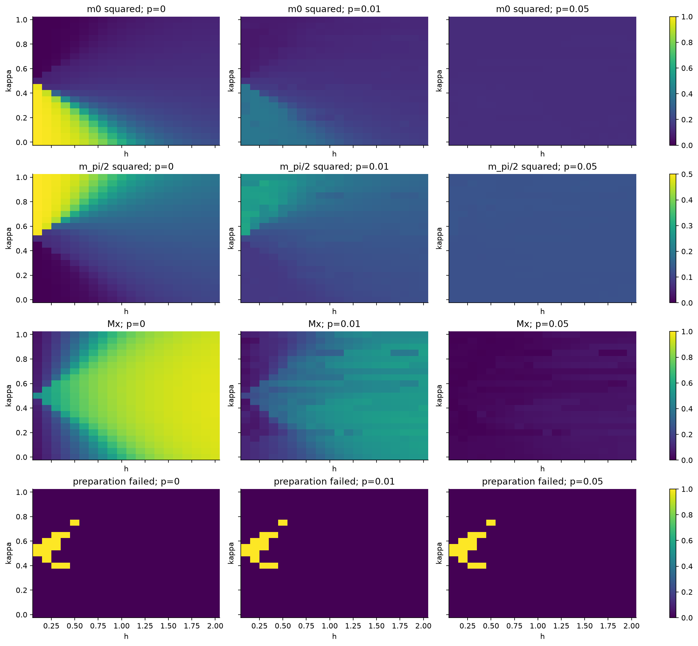

# Stage 3：优化稳定化与逐门噪声实测

A/B/C 均实际完成；正场网格状态：**complete**。N=8 周期边界，未修改旧结果和 upstream。
固定 L=6 的切片获选覆盖 120/120，L=4 为 107/120。选择是六条独立方向/种子链中的最低能量，不能称为冷启动 100% 成功。

## A：固定 L=6 的补救

目标 (0.3,0.4)：旧参数追加最多1600步通过1/3；六个新冷启动通过4/6；从h=.5经.45到.4的独立来源延续通过3/3。
延续组目标δe中位数3.6553e-5、F中位数0.9999314。续跑仅恢复参数，不恢复L-BFGS历史。
共39条A记录，包含四个额外点及所有失败，未超过60条上限。原400步和累计成本保存在每条记录。
同样预算并不能消除所有局部最优；已有准确解支持优先改善初始化，而非把困难点直接归因于表达能力。

## B：匹配冷启动队列与深度噪声

5点×3深度×3新种子，共45个优化配置（其中3个与A2完全相同，哈希校验后复用），再做45个密度矩阵评估，完整保存45个rho。
各(point,L)在含噪计算前按无噪声能量冻结参数。浅层失败继续计算并标记。
每层32个CNOT；L2/4/6分别64/128/192个，实际单元门深度75/149/223。零角度块与κ=0的NNN块不删除。

|kappa|h|L|cold_pass|pass0|delta_e|F0|SFerr_p0|SFerr_p01|SFerr_p05|Rmix_p05|Dmix_p05|
|---|---|---|---|---|---|---|---|---|---|---|---|
|0|0.2|2|0/3|False|0.206|0.579099|0.368|0.4926|0.744|0.01115|0.3792|
|0|0.2|4|0/3|False|0.00946|0.988263|0.01244|0.4391|0.826|0.0006501|0.1463|
|0|0.2|6|2/3|True|4.25e-13|1.000000|2.196e-08|0.6101|0.8616|1.561e-05|0.02522|
|0|1.8|2|1/3|True|0.000587|0.999263|0.00418|0.02968|0.08865|0.01879|0.4486|
|0|1.8|4|2/3|True|1.65e-05|0.999989|0.0001821|0.0527|0.1211|0.001208|0.1891|
|0|1.8|6|3/3|True|2.86e-09|1.000000|8.168e-06|0.09371|0.1303|3.115e-06|0.01104|
|0.3|0.4|2|0/3|False|0.0181|0.730062|0.4079|0.479|0.6257|0.01055|0.3722|
|0.3|0.4|4|0/3|False|0.00719|0.915214|0.1811|0.4104|0.6585|0.000742|0.1525|
|0.3|0.4|6|2/3|True|1.01e-05|0.999981|2.777e-05|0.4797|0.6875|1.645e-05|0.02565|
|0.8|0.2|2|3/3|True|7.79e-05|0.999740|0.0002593|0.1049|0.301|0.005564|0.2697|
|0.8|0.2|4|3/3|True|3.1e-06|0.999991|2.126e-05|0.1581|0.3468|0.0002081|0.08289|
|0.8|0.2|6|3/3|True|2.7e-06|0.999992|1.912e-05|0.2363|0.3647|9.338e-06|0.01888|
|0.8|0.5|2|0/3|False|0.00576|0.966338|0.02618|0.05083|0.2094|0.01186|0.3879|
|0.8|0.5|4|0/3|False|0.00154|0.992842|0.01056|0.1274|0.2784|0.0001723|0.07515|
|0.8|0.5|6|0/3|False|0.000749|0.997692|0.005788|0.1604|0.288|2.153e-05|0.029|

更深的理想制态收益没有保证含噪总误差单调降低。总误差含制态误差与噪声增量；逐分量差严格可加，最大范数不可直接相加。
误差抵消不是误差缓解。相同门数仍有角度和误差传播差异，不能解释成不同相的固有抗噪性。
R_mix与D_mix保留数值，不能因purity四舍五入接近1/256而断言完全混合。

## C：完整含噪切片

κ=0,.3,.8；h=.05,.10,…,2；L=4,6；p=0,.01,.05。1440条优化记录、720个主噪声配置、11个位置的33个反方向对照全部完成。
每个方向使用101/211/307三个独立来源链，不在链之间复制获胜参数。每条2000步上限，退出原因、全部初末参数可查。
获选制态失败位置如下（其余点通过）：

|kappa|layers|h|
|---|---|---|
|0|4|[]|
|0.3|4|[0.4, 0.45, 0.5]|
|0.8|4|[0.5, 0.55, 0.6, 0.65, 0.7, 0.75, 0.8, 0.85, 0.9, 0.95]|
|0|6|[]|
|0.3|6|[]|
|0.8|6|[]|

反方向对照有15/33个(p,位置)超过预设物理量差.02，详细位置在preparation_protocol_sensitivity.csv。
未检查位置的branch_sensitive保留null，不把缺乏证据写成无分支效应。参数切换位置可从selected.csv追溯。上下文质量标记以各组observations.json/CSV与noise_records为准；density_cache中的branch_sensitive是未使用的后端默认值，不能解读为已做分支检查。复用切片参数的网格记录继承已有检查结果。

红色区间为制态失败；顶部短线为参数来源切换。

κ=.8的竞争波矢逐点保存在wavevector_competition.csv；q与2π-q折叠只用于峰诊断，原始数据保留8个q。
π/2信号降低与其他q权重变化分开处理；不据此确认floating phase。

## 有限尺寸诊断与边界解释

保留diagnostics_v1控制态原型与阈值。额外可分辨性规则在计算前冻结于stage3_v1配置：无平滑/插值，连续有效区间内差分；幅度≥.02、导数峰显著度≥.02；两个隔点网格均需稳定；端点峰、失败间隙、未核查的分支切换邻域不用于边界结论。
全部局部峰含端点、峰宽、显著度和网格支撑区间均保存。共10个峰满足单曲线规则，但没有互补指标共同支持的非零位移。
少数Mx配对只是single_indicator_only，其位移网格支撑包含零；不作为测得的边界移动。其他记录为not_resolved，而非零位移。

网格支撑不是统计置信区间；确定性shots=None数据不产生抽样误差条。原型标签只表征控制态相似性，完全混合态归degraded，不等同高场基态。

## 正场网格与推进判断

{
  "status": "complete",
  "layers": 6,
  "points": 420,
  "evaluations": 1260,
  "joint_pass": 407,
  "noise_executed": 1080,
  "noise_cached": 180,
  "new_optimization_records": 2160
}

网格范围κ=0:.05:1、h=.1:.1:2，**不含h=0**。L=6由理想覆盖率和资源选定，未按噪声图外观选层数。
对三条已有切片的相同点复用冻结参数；其余κ分别由邻近切片同seed同direction的端点初始化，再各自延续。
网格逐点重新验证制态，失败保存真实值；没有以ED输出替代。

|kappa|h|delta_e|fidelity|
|---|---|---|---|
|0.4|0.3|0.00010993575295625835|0.9991618943261068|
|0.4|0.4|0.0002201210353875993|0.9992109284368362|
|0.45|0.2|0.0005106497669401522|0.9977845315248426|
|0.5|0.1|0.0018072570910405705|0.9873482201523511|
|0.5|0.2|0.0011729692733595254|0.9958807039960227|
|0.55|0.1|9.41062255290781e-05|0.9913859010313266|
|0.55|0.2|0.0017317900945901243|0.9907784388207521|
|0.55|0.3|0.0011833377885530627|0.9959188221675025|
|0.6|0.2|0.00022704587489186245|0.9952997029008538|
|0.6|0.3|0.0020518569905233486|0.9889469290805956|
|0.65|0.3|0.0005202778895553317|0.9943601678907997|
|0.65|0.4|0.0012180421137701902|0.9966941444965011|
|0.75|0.5|0.0010493292671697185|0.9972697605904505|

主结论限定连续物理量与质量掩码，未经分支验证的局部特征不宣称边界。

**CONDITIONAL GO**：可以继续有区域质量控制的连续物理量分析；严格边界或四相分类仍需局部同协议、同网格的分支核查与加密。

## 数值验证、复现与资源

本轮33项回归测试通过；逐结果审计见verification/result_audit.json。随机及近最优参数下，快速纯态与PennyLane、解析梯度与有限差分交叉验证；密度后端与PennyLane完整矩阵代表配置差异约5e-14。
每个实际密度计算均检查迹、厄米性、半正定性、能量/SF恒等式、C(0)、有符号误差分解；每个p=0密度与纯态外积一致。
密度使用完整256×256，未施加对称投影。所有NN/NNN边直接可执行，无另一赛道硬件路由约束；每个CNOT后仅target加规定通道。
小范围PennyLane交叉验证不代表所有参数点逐一与该后端重算；全结果恒等式与归档哈希另行检查。

实测唯一优化执行3681次，累计端到端508.0秒；唯一密度执行1878次，累计端到端208.3秒。
编写/检查/等待在内截至报告的墙钟24.3分钟，预设预算90分钟。纯演化和后处理时间独立存metadata；缓存命中不算新增执行。
已执行notebook全部代码单元，并重新计算一个L2代表态与PennyLane密度对照。nbconvert未安装，HTML预览改用标准库生成；无环境升级。图像已检查色标与布局，未用浏览器逐页检查HTML。首次导出失败日志保留。
未升级环境；Python与库版本、所有输入/代码哈希在metadata。无真实硬件、无抽样、无N≥12 VQE、无局部加密。

复现入口：项目根目录执行 `bash scripts/reproduce_stage3.sh`。默认校验并重建报告/notebook；`--compute`按原指纹复用断点继续计算，原会话预算到期时停止，不静默重设预算。
下一轮建议固定L6，沿用阈值，优先针对失败格点及候选峰邻域进行独立分支检查，p三值同步加密；不要直接扩大尺寸或放宽门槛。
结果包包含源码、锁文件、既有必需输入、所有新原始数据、执行日志和notebook；ZIP解压校验结果另附sidecar。
