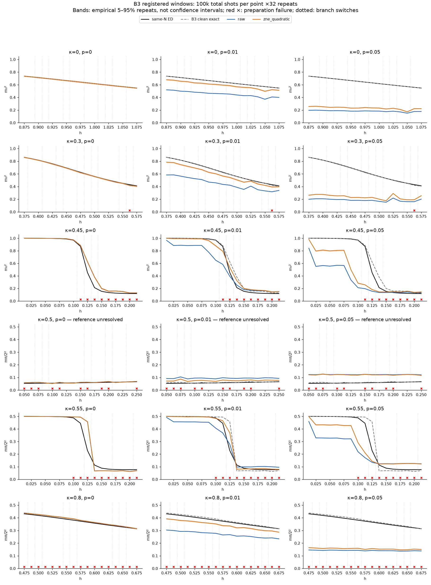
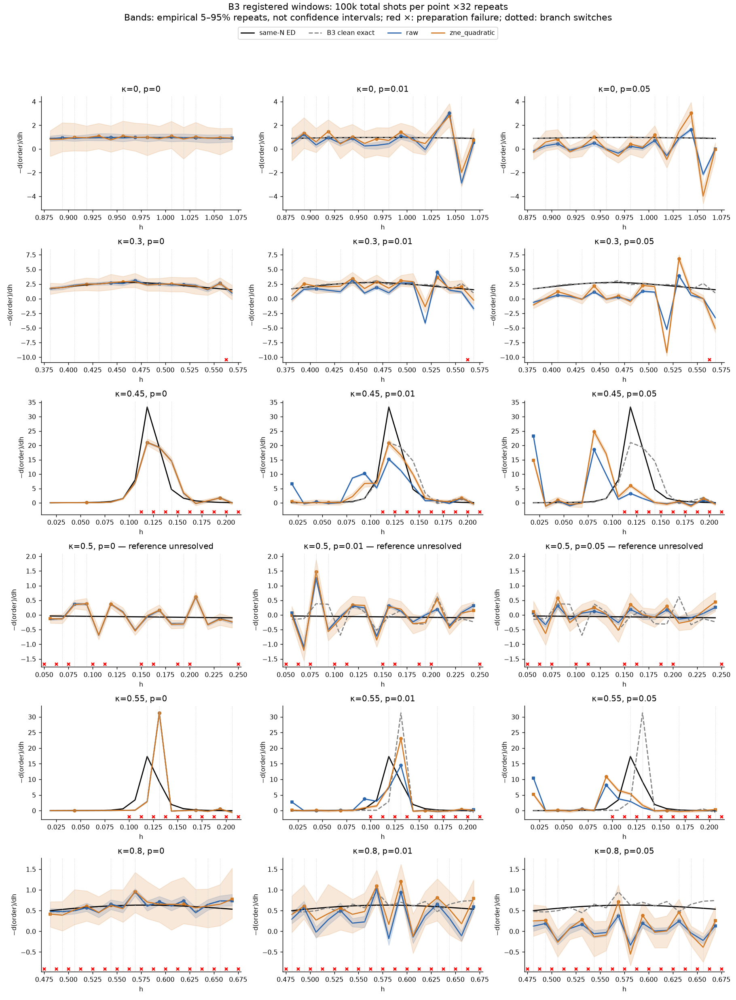
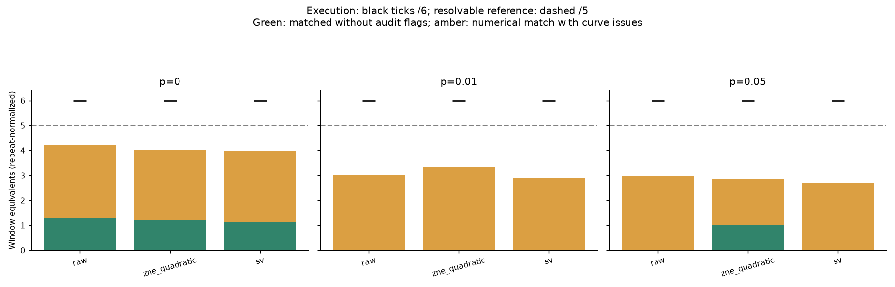
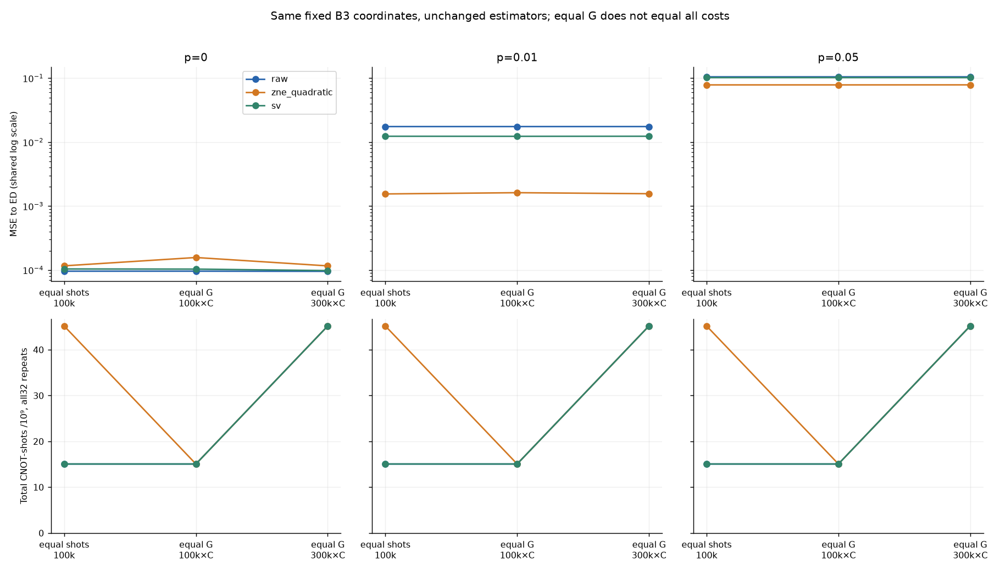
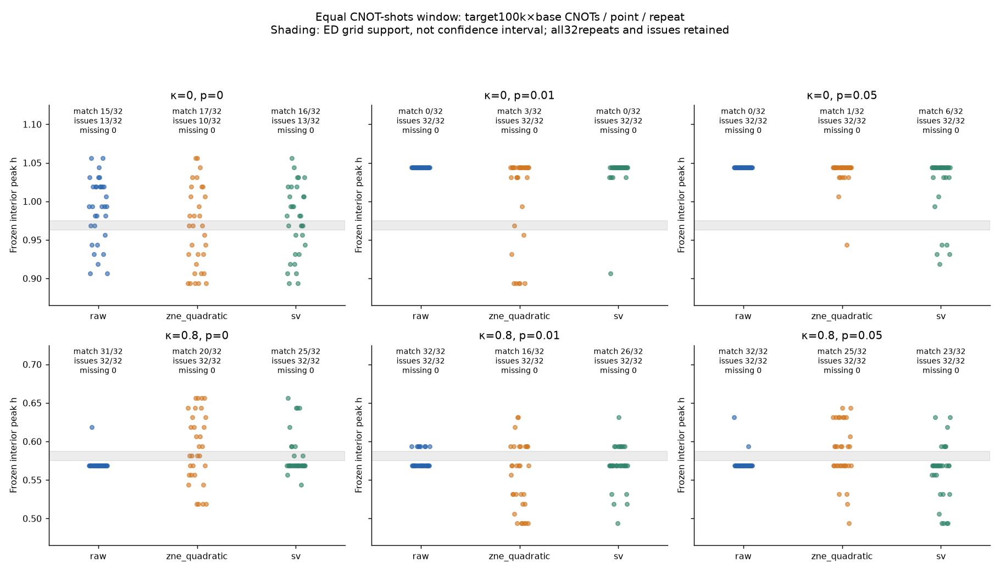

# Stage 6 directed followup: B3 windows and equal CNOT-shots

## Actual findings

The execution gap is closed, but reliable boundary recovery is not established. New κ=0 and.3 noisy curves contain structure-sensitive peaks; κ=.5 remains reference-unresolved. At100k equal shots, p=.05 raw gives2.96875/5 matched window equivalents and quadratic ZNE2.875/5; these are32-repeat-normalized values, not integer counts of independently validated transitions. Raw matches include endpoint-dominated κ=.45/.55 curves.

At equal CNOT-shots target100k×C and p=0.01, quadratic ZNE reduces mean ED-target MSE from0.017544297 to0.001622712 (90.75% reduction), improving45/45 tested coordinates. SV gives0.012352926. Raw exact bias squared is0.017546169, compared with sampling MSE1.52e-06; ZNE lowers exact bias to0.0015400774 while increasing sampling MSE to7.38e-05. Thus the net gain is primarily bias reduction, not extra shots or lower variance. Sampling MSE includes finite-sample bias; point tables also report variance and the exact cross-term decomposition.
At equal CNOT-shots target100k×C and p=0.05, quadratic ZNE reduces mean ED-target MSE from0.10511371 to0.078636114 (25.19% reduction), improving45/45 tested coordinates. SV gives0.10231166. Raw exact bias squared is0.10511665, compared with sampling MSE1.53e-06; ZNE lowers exact bias to0.078657788 while increasing sampling MSE to7.49e-05. Thus the net gain is primarily bias reduction, not extra shots or lower variance. Sampling MSE includes finite-sample bias; point tables also report variance and the exact cross-term decomposition.

At p0, ZNE worsens MSE on45/45points at the main equal-G budget. At p=.05, SV improves40/45 and worsens5/45. More raw shots at the high budget barely change noise-dominated MSE. The restricted equal-resource κ=0/.8 window pair shows that lower observable MSE is not better feature localization: at p=.01, raw matches1/2 window equivalents while ZNE matches.59375/2; at p=.05, values are1/2 and.8125/2. These numerically matched noisy curves retain audit issues.

Only6/45coordinates have independent interior labels. At p=.05/main equal-G, D3 gives raw4/6 and ZNE4.25/6 correct coordinate-equivalents averaged over32repeats; this small local change is not proof of whole-phase classification recovery or a statistical significance claim.

Run `stage6_followup_20260924T003006Z`. Started 2026-09-24T00:30:06.054566+00:00; fixed deadline 2026-09-24T04:30:06.054566+00:00. This is a new directed supplement, not a retroactive preregistered Stage6 experiment.

## Scope and execution

All six B3 registered windows complete: **True**. Newly filled κ=0,.3,.5; κ=.45,.55,.8 historical records reused after gate/hash checks. Each has17registered points, p=0,.01,.05, raw/quadratic ZNE/SV,10k/100k total shots and32repeats. H6 remains historical three-window coverage. No VQE, new ansatz, selection or detector retraining.

Equal-resource cohort: 45 unique coordinates, comprising12 fixed representatives plus complete κ=0,.8 windows, with overlap retained as analysis roles. Coordinates were frozen before new sampling. Both100k×C and300k×C targets executed; zero-CNOT cases are separate fixed-shots controls.

## Exact resource definition

G = Σ_settings shots × literal CNOT count. ZNE1/3/5 scales use unchanged nearly equal allocation; choose the maximal integer total not exceeding the target. Raw/SV totalshots equal Σ_fold fold×ZNE_shots, producing exactly equal actual G without identity padding.

| Target equivalent shots | ZNE total shots | Raw/SV total shots | Unspent equivalent shots |
|---:|---:|---:|---:|
| 100000 | 33334 | 100000 | 0 |
| 300000 | 100000 | 299998 | 2 |

SV has30local settings; raw has2; ZNE has6. Extra local measurement gates and all settings are charged separately. Equality of G is not equality of all costs. The full C/SF/Mx vector retains17equal-weight components, including correlated Fourier-related components, to preserve the historical MSE definition. Group errors are separately reported; no new reweighting.

## Same-coordinate estimator results

| Protocol | Budget | p | Estimator | Coordinates | MSE ED | MSE own clean | Total G,32 repeats |
|---|---:|---:|---|---:|---:|---:|---:|
| equal_shots | 100000 | 0 | raw | 45 | 9.6065786e-05 | 1.2529054e-06 | 15062400000 |
| equal_shots | 100000 | 0 | zne_quadratic | 45 | 0.00011654415 | 1.9666096e-05 | 45186898752 |
| equal_shots | 100000 | 0 | sv | 45 | 0.00010417226 | 9.9807754e-06 | 15062400000 |
| equal_shots | 100000 | 0.01 | raw | 45 | 0.017541322 | 0.018147358 | 15062400000 |
| equal_shots | 100000 | 0.01 | zne_quadratic | 45 | 0.0015509048 | 0.0016987112 | 45186898752 |
| equal_shots | 100000 | 0.01 | sv | 45 | 0.012374165 | 0.012892679 | 15062400000 |
| equal_shots | 100000 | 0.05 | raw | 45 | 0.10511911 | 0.10653044 | 15062400000 |
| equal_shots | 100000 | 0.05 | zne_quadratic | 45 | 0.078642035 | 0.079976515 | 45186898752 |
| equal_shots | 100000 | 0.05 | sv | 45 | 0.10226571 | 0.10367574 | 15062400000 |
| equal_gate | 100000 | 0 | raw | 45 | 9.6155837e-05 | 1.2451518e-06 | 15062400000 |
| equal_gate | 100000 | 0 | zne_quadratic | 45 | 0.00015727574 | 5.8309805e-05 | 15062400000 |
| equal_gate | 100000 | 0 | sv | 45 | 0.00010363441 | 9.8433952e-06 | 15062400000 |
| equal_gate | 100000 | 0.01 | raw | 45 | 0.017544297 | 0.018151236 | 15062400000 |
| equal_gate | 100000 | 0.01 | zne_quadratic | 45 | 0.001622712 | 0.001769942 | 15062400000 |
| equal_gate | 100000 | 0.01 | sv | 45 | 0.012352926 | 0.012870216 | 15062400000 |
| equal_gate | 100000 | 0.05 | raw | 45 | 0.10511371 | 0.10652572 | 15062400000 |
| equal_gate | 100000 | 0.05 | zne_quadratic | 45 | 0.078636114 | 0.07997129 | 15062400000 |
| equal_gate | 100000 | 0.05 | sv | 45 | 0.10231166 | 0.10371876 | 15062400000 |
| equal_gate | 300000 | 0 | raw | 45 | 9.5613439e-05 | 4.1896044e-07 | 45186898752 |
| equal_gate | 300000 | 0 | zne_quadratic | 45 | 0.00011635044 | 1.9480326e-05 | 45186898752 |
| equal_gate | 300000 | 0 | sv | 45 | 9.8213227e-05 | 3.2646588e-06 | 45186898752 |
| equal_gate | 300000 | 0.01 | raw | 45 | 0.017547228 | 0.018153912 | 45186898752 |
| equal_gate | 300000 | 0.01 | zne_quadratic | 45 | 0.0015628326 | 0.0017080627 | 45186898752 |
| equal_gate | 300000 | 0.01 | sv | 45 | 0.012379059 | 0.012898783 | 45186898752 |
| equal_gate | 300000 | 0.05 | raw | 45 | 0.10511494 | 0.10652709 | 45186898752 |
| equal_gate | 300000 | 0.05 | zne_quadratic | 45 | 0.078732603 | 0.080068325 | 45186898752 |
| equal_gate | 300000 | 0.05 | sv | 45 | 0.10224418 | 0.10365468 | 45186898752 |

### Paired changes versus same-budget raw

| Protocol | Budget | p | Estimator | Mean MSE change | Improved / worse / equal coordinates |
|---|---:|---:|---|---:|---|
| equal_shots | 100000 | 0 | zne_quadratic | 2.0478364e-05 | 3 / 42 / 0 |
| equal_shots | 100000 | 0 | sv | 8.1064718e-06 | 2 / 43 / 0 |
| equal_shots | 100000 | 0.01 | zne_quadratic | -0.015990417 | 45 / 0 / 0 |
| equal_shots | 100000 | 0.01 | sv | -0.005167157 | 45 / 0 / 0 |
| equal_shots | 100000 | 0.05 | zne_quadratic | -0.026477072 | 45 / 0 / 0 |
| equal_shots | 100000 | 0.05 | sv | -0.0028533975 | 40 / 5 / 0 |
| equal_gate | 100000 | 0 | zne_quadratic | 6.1119907e-05 | 0 / 45 / 0 |
| equal_gate | 100000 | 0 | sv | 7.4785746e-06 | 2 / 43 / 0 |
| equal_gate | 100000 | 0.01 | zne_quadratic | -0.015921585 | 45 / 0 / 0 |
| equal_gate | 100000 | 0.01 | sv | -0.0051913714 | 45 / 0 / 0 |
| equal_gate | 100000 | 0.05 | zne_quadratic | -0.026477591 | 45 / 0 / 0 |
| equal_gate | 100000 | 0.05 | sv | -0.0028020477 | 40 / 5 / 0 |
| equal_gate | 300000 | 0 | zne_quadratic | 2.0737e-05 | 1 / 44 / 0 |
| equal_gate | 300000 | 0 | sv | 2.5997879e-06 | 4 / 41 / 0 |
| equal_gate | 300000 | 0.01 | zne_quadratic | -0.015984395 | 45 / 0 / 0 |
| equal_gate | 300000 | 0.01 | sv | -0.0051681689 | 45 / 0 / 0 |
| equal_gate | 300000 | 0.05 | zne_quadratic | -0.026382334 | 45 / 0 / 0 |
| equal_gate | 300000 | 0.05 | sv | -0.0028707584 | 43 / 2 / 0 |

[Full point metrics](equal_gate_budget/point_metrics.csv) include C/SF/Mx errors, physical-label eligibility, D3correct/wrong/reject outputs for every repeat, bias/sampling/cross-term decomposition and unclipped estimates. [Resource audit](equal_gate_budget/resource_audit.csv) lists every allocation. [Window costs](window_completion/window_costs.csv) sum all17points and all32repeats, separately for each p.

## Frozen window scores versus curve audit

| Protocol | Budget | p | Estimator | Executed/requested | Reference-resolvable | Matched window equivalents | Matches with issues | Matches without issues |
|---|---:|---:|---|---|---:|---:|---:|---:|
| equal_shots | 100000 | 0 | raw | 6/6 | 5 | 4.2188 | 2.9375 | 1.2812 |
| equal_shots | 100000 | 0 | zne_quadratic | 6/6 | 5 | 4.0312 | 2.8125 | 1.2188 |
| equal_shots | 100000 | 0 | sv | 6/6 | 5 | 3.9688 | 2.8438 | 1.125 |
| equal_shots | 100000 | 0.01 | raw | 6/6 | 5 | 3 | 3 | 0 |
| equal_shots | 100000 | 0.01 | zne_quadratic | 6/6 | 5 | 3.3438 | 3.3438 | 0 |
| equal_shots | 100000 | 0.01 | sv | 6/6 | 5 | 2.9062 | 2.9062 | 0 |
| equal_shots | 100000 | 0.05 | raw | 6/6 | 5 | 2.9688 | 2.9688 | 0 |
| equal_shots | 100000 | 0.05 | zne_quadratic | 6/6 | 5 | 2.875 | 1.875 | 1 |
| equal_shots | 100000 | 0.05 | sv | 6/6 | 5 | 2.6875 | 2.6875 | 0 |
| equal_gate | 100000 | 0 | raw | 2/2 | 2 | 1.4375 | 0.96875 | 0.46875 |
| equal_gate | 100000 | 0 | zne_quadratic | 2/2 | 2 | 1.1562 | 0.6875 | 0.46875 |
| equal_gate | 100000 | 0 | sv | 2/2 | 2 | 1.2812 | 0.875 | 0.40625 |
| equal_gate | 100000 | 0.01 | raw | 2/2 | 2 | 1 | 1 | 0 |
| equal_gate | 100000 | 0.01 | zne_quadratic | 2/2 | 2 | 0.59375 | 0.59375 | 0 |
| equal_gate | 100000 | 0.01 | sv | 2/2 | 2 | 0.8125 | 0.8125 | 0 |
| equal_gate | 100000 | 0.05 | raw | 2/2 | 2 | 1 | 1 | 0 |
| equal_gate | 100000 | 0.05 | zne_quadratic | 2/2 | 2 | 0.8125 | 0.8125 | 0 |
| equal_gate | 100000 | 0.05 | sv | 2/2 | 2 | 0.90625 | 0.90625 | 0 |

Each window is averaged over32complete-curve repetitions before summing window equivalents. These are not thousands of independent boundaries. A frozen interior-peak match remains a match even with a larger endpoint response; the separate issue flags prevent claiming it as reliable physical recovery. All peak lists and failed/unresolved repeats remain in [matches.json](window_completion/matches.json).

κ=.5 is still reference_unresolved. Its curves were executed, but qualified displacements are null. The observational audit does not move/recenter windows or change frozen thresholds. Curves retain all preparation failures; no interpolation fills them. Signed δh_ED includes preparation/diagnostic differences; Δh_noise uses the same circuit protocol at p0 and is withheld where either required feature/curve is unsupported.

[Historical actual branch comparisons](branch_switches_historical.json) preserve both switched branches at the same coordinate. [New bounded branch controls](window_completion/branch_controls.json) check selected critical switches under noise; untested switches are not called harmless.

## Figures

### Order curves



### Full response curves with all local peaks



### Execution, matching and curve issues



### Equal shots versus equal CNOT-shots



### All equal-resource window repeats and failures



## Evidence and reproduction

Unique new measurement records: 2376; reused records: 990. New joint multinomial draws: 963072; represented new simulated shots: 6788145600. These are classical samples of saved quantum-model probabilities, not QPU executions. New density records: 579; reused probability records: 771. Summed newly simulated density time: 169.53s. Peak process RSS: 2.094GiB.

Old and new counts are never obtained by scaling plotted curves. New gate-budget counts use independent explicitly keyed random streams; same-setting observables retain covariance through whole-bitstring counts. Historical equal-shots common streams remain tagged; paired statistics group physical coordinates and never count shared estimator analyses as new execution.

Install the scientific or portable environment using [the reproduction instructions](../../docs/REPRODUCE.md), then run these commands from the repository root:

```sh
bash scripts/stage6_followup.sh --verify
bash scripts/stage6_followup.sh --redraw
```

The default interpreter is `.venv/bin/python`. For another installed environment, prefix either command with `ANNNI_PYTHON=/path/to/python`.

`--verify` runs the release V1 check: it verifies the package hashes, reconstructs all 2,718 active records from saved joint counts, and checks coordinates, gate tables and equal CNOT-shot budgets. Its receipt is written to `build/stage6_followup/verification/verify_data.json`. This is a saved-data check; physical circuit checks and environment-specific random replay have separate commands in the reproduction instructions.

`--redraw` recreates the five figures above from bundled numerical tables and curves, writing them to `build/stage6_followup/figures/`. The published images remain in `results/stage6_followup_v1/figures/`. These commands leave the archived data and published files unchanged and require no optional Release assets.

The original research run has ended. Its historical resume procedures and deadlines do not apply to this publication entry point. The executed notebook separates saved experiments from representative count reconstruction; the commands above verify and redraw the completed followup.

## Followup implementation provenance

The first A attempt stopped when a same-coordinate core record had a different literal B3 gate table from the registered window. The assertion prevented consuming it. A versioned lookup fix rejects that source and searches compatible records; the catalog retains both core and window fingerprints. Valid earlier draws remain archived and costed but are not pooled with final draws after the sampler fingerprint changed. This is an execution/cache correction, not a change in B3 or mitigation. See verification/A_attempt1_failure.log and verification/cache_catalog_enrichment.json.

Before B began, the original control at(.7,1.5), which lacked an independent interior label, was replaced by the declared antiphase interior(.8,.1). The original config, time and unchanged deadline are retained in verification/control_cohort_amendment.json. No equal-resource outcomes had been generated.

Final completion inventories: [windows](window_inventory_completed.csv), [resource experiments](resource_experiment_inventory_completed.csv), [old-versus-new coverage](window_completion/old_vs_followup_coverage.csv). Initial inventories remain separate snapshots.

## Actual switched-branch noise controls

These compare the two actual switched branches at one identical coordinate. They are not alternative opposite-direction surrogates, error bars or proof that every switch is harmless.

| κ | Switch interval | Same coordinate h | Max C difference p0 | p=.01 | p=.05 |
|---:|---|---:|---:|---:|---:|
| 0.0 | [0.95,0.9625] | 0.9625 | 0.00159752 | 0.0116836 | 0.00635502 |
| 0.0 | [1.05,1.0625] | 1.05 | 3.95452e-05 | 0.00396552 | 0.0034272 |
| 0.3 | [0.4625,0.475] | 0.4625 | 0.000312504 | 0.0672909 | 0.0601537 |
| 0.3 | [0.5,0.5125] | 0.5 | 0.00234443 | 0.0324757 | 0.0247833 |
| 0.45 | [0.1125,0.125] | 0.1125 | 0.0107303 | 0.0768999 | 0.0593943 |
| 0.5 | [0.15,0.1625] | 0.15 | 0.0312938 | 0.00967158 | 0.0188379 |
| 0.5 | [0.0625,0.075] | 0.075 | 0.0092662 | 0.0244683 | 0.0105426 |
| 0.55 | [0.1125,0.125] | 0.1125 | 0.762622 | 0.535481 | 0.105901 |
| 0.8 | [0.5625,0.575] | 0.5625 | 0.0016932 | 0.00507094 | 0.00358463 |
| 0.8 | [0.5375,0.55] | 0.5375 | 0.0229876 | 0.0219315 | 0.0126487 |

The final analysis contains2718measurement records:1728new records and990historical reused records. Each has32repeats. An additional648valid first-attempt records are retained, excluded from final inference, and included in the actual execution-cost totals above. The110active unique coordinates are102window coordinates plus8additional representatives; the45-point B cohort overlaps the A windows. At overlapping representative/window coordinates the intake consistently keeps the registered window's frozen B3 circuit for both roles; this was determined before B outcomes, not selected by mitigation performance.
